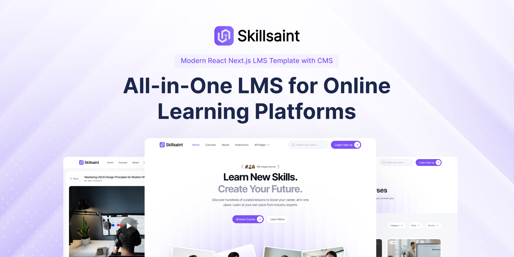

# EdventureHub - React Next.js Sanity LMS Template

EdventureHub is a production-ready **LMS template built with React, Next.js, and Sanity CMS**. Launch and manage your online learning platform with structured content, secure payments, and full admin control - all on a scalable **Tailwind CSS** styling foundation.

#### [🚀 Visit Website](https://edventurehub.com)

#### [🚀 Live Demo](https://demo.edventurehub.com)

#### [🔥 Get Pro](https://edventurehub.com/pricing)

#### [🔌 Documentation](https://edventurehub.com/docs)

## Feature Highlights
This is a free, light, open-source version of EdventureHub to try out and use as a landing page. EdventureHub Pro includes all the features with fully functional LMS features mentioned below.

### **Modern Tech-Stack**
Built with React, Next.js, Tailwind CSS, and Sanity CMS for performance, SEO, and flexible content management.

### **Complete LMS Features with CMS**
Courses, lessons, user authentication, enrollment, dashboards, progress tracking, and certifications - everything needed to run a full LMS powered by Sanity CMS.

### **Integrated Payments**
Stripe-powered checkout for paid courses. Secure payments, automatic enrollment, and controlled access to premium content.

### **Essential Integrations**
Sanity for content, Prisma for PostgreSQL, Stripe for payments, Auth.js for authentication and many more - ready to use out of the box.

### **Scalable & Extendable**
Start with a solid boilerplate and extend as your platform grows. Clean architecture designed for customization.

### **Responsive & High-Quality UI**

Fully responsive learning interface and dashboard with clean layouts and intuitive navigation.

### **Lifetime Updates**

Free lifetime updates with ongoing improvements and enhancements.

**Detailed Documentation**

Step-by-step setup and customization guides to help you launch and scale efficiently.
